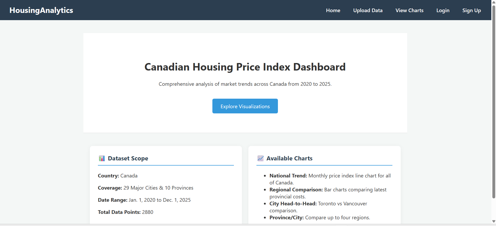
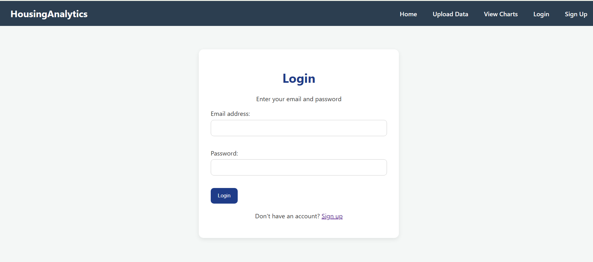
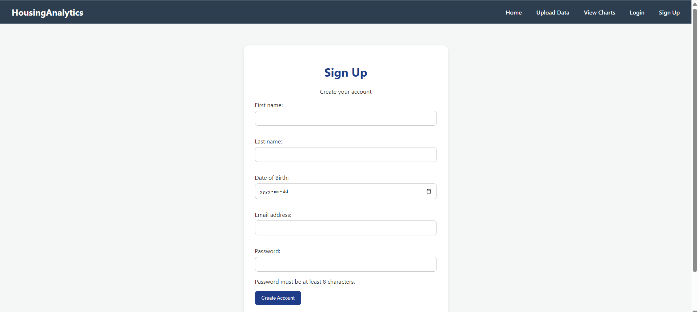
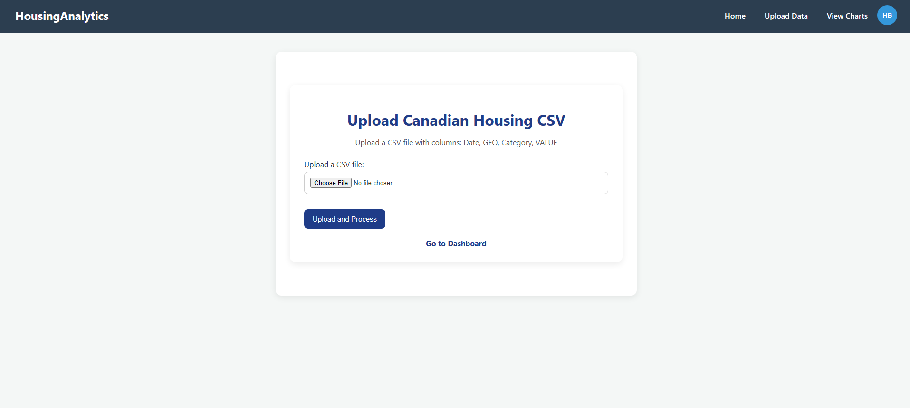
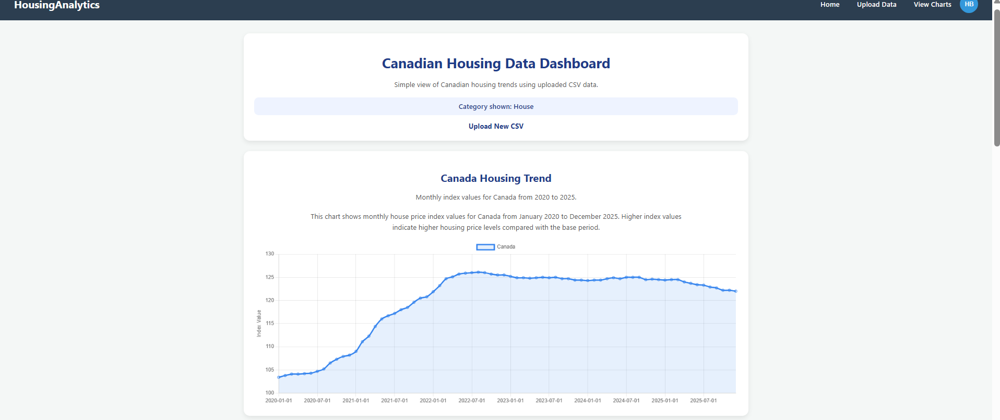
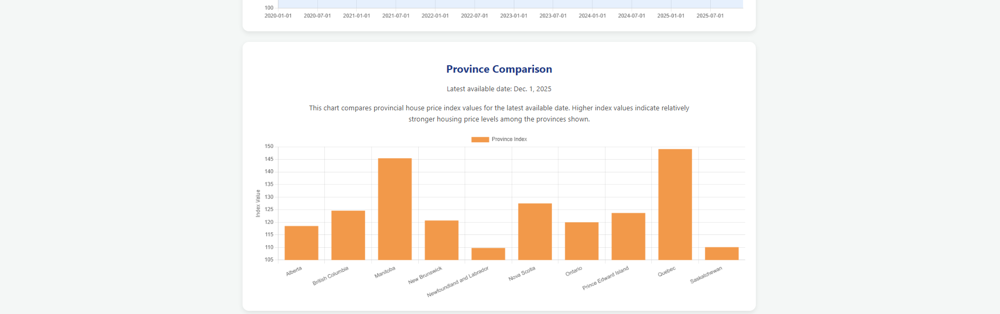
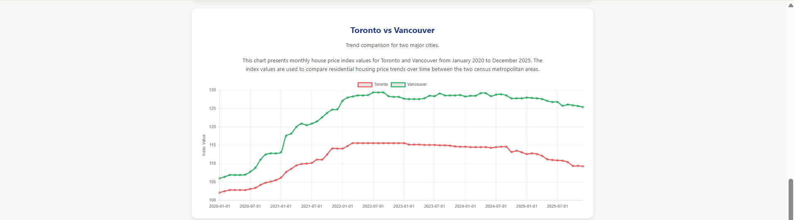
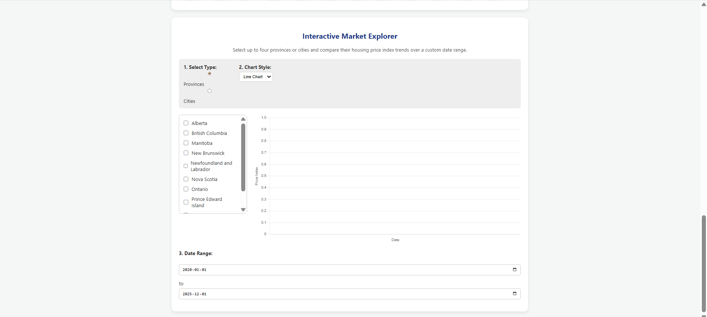

# HousingAnalytics

**A full-stack Django dashboard for exploring Canadian housing price index data.**

Upload raw Statistics Canada CSV datasets and instantly explore national trends, provincial comparisons, and city-level breakdowns through interactive Chart.js visualizations — no data wrangling required.

---

## Table of Contents

- [Project Overview](#project-overview)
- [Features](#features)
- [Database Schema](#database-schema)
- [Tech Stack](#tech-stack)
- [Environment Setup](#environment-setup)
- [Running the Project](#running-the-project)
- [CSV Format](#csv-format)
- [Project Structure](#project-structure)
- [Architecture](#architecture)

---

## Project Overview

Housing affordability is one of Canada's most pressing economic challenges. Statistics Canada publishes detailed Housing Price Index (HPI) datasets — but exploring them requires manual data cleaning and custom scripts that most users can't easily perform.

**HousingAnalytics** solves this by providing a secure, authenticated web dashboard that ingests raw Statistics Canada CSV files and turns them into interactive visualizations in seconds.

---

## Features

- **Secure Authentication** — Email-based registration and login built on Django's built-in auth system, extended with a custom `UserProfile` model to store date of birth. All forms are CSRF-protected.
- **Protected Routes** — The upload page and charts page both require authentication via `@login_required`. Unauthenticated users are automatically redirected to the login page.
- **CSV Ingestion Pipeline** — Upload raw Statistics Canada HPI files. The pipeline validates that all required columns are present (`Date`, `GEO`, `Category`, `VALUE`), handles `UTF-8-sig` encoding (common in Statistics Canada exports), skips incomplete or malformed rows gracefully, and uses Django's `update_or_create` for idempotent imports — re-uploading the same file never creates duplicate records.
- **Four Chart Views** powered by Chart.js:
  - National HPI time-series line chart (Canada overall, 2020–2025)
  - Provincial index bar chart showing the most recently available date across all 10 provinces
  - Toronto vs. Vancouver side-by-side line chart for direct city comparison
  - Interactive Market Explorer — select up to 4 provinces or cities, choose a custom date range, and toggle between line and bar chart views
- **Django Admin Panel** — Full `HousingData` admin with filtering by region, category, and date; full-text search by geo and category; default sort by most recent date descending.
  

## Demo Preview
### Homepage


### Login Page



### SignUp Page



### Upload Page



### Charts Page 





---


## Database Schema

The application uses two models stored in a SQLite database alongside Django's built-in `auth_user` table.

```
┌─────────────────────────────────┐     ┌──────────────────────────────────────┐
│           auth_user             │     │       dashboard_userprofile           │
├─────────────────────────────────┤     ├──────────────────────────────────────┤
│ id           INTEGER   PK       │◄────│ id       INTEGER   PK                │
│ username     VARCHAR(150)       │     │ user_id  INTEGER   FK (auth_user.id) │
│ first_name   VARCHAR(150)       │     │ dob      DATE                        │
│ last_name    VARCHAR(150)       │     └──────────────────────────────────────┘
│ email        VARCHAR(254)       │
│ password     VARCHAR(128)       │      OneToOne — cascade delete
│ is_staff     BOOLEAN            │
│ is_active    BOOLEAN            │
│ date_joined  DATETIME           │
└─────────────────────────────────┘

┌──────────────────────────────────┐
│      dashboard_housingdata       │
├──────────────────────────────────┤
│ id        INTEGER    PK          │
│ date      DATE                   │
│ geo       VARCHAR(255)           │
│ category  VARCHAR(100)           │
│ value     DECIMAL(10, 2)         │
└──────────────────────────────────┘
```

**Key design decisions:**
- `dashboard_userprofile` extends the built-in `auth_user` table via a OneToOne relationship, adding `dob` (date of birth) that Django's default User model does not include.
- `dashboard_housingdata` is a flat, denormalized table that maps directly to the Statistics Canada CSV structure — one row per (date, geo, category) combination.
- Idempotent imports use `(date, geo, category)` as the logical unique key at the application layer via `update_or_create`. Re-uploading the same CSV updates existing records rather than inserting duplicates.

---

## Tech Stack

| Layer      | Technology                        | Version       |
|------------|-----------------------------------|---------------|
| Language   | Python                            | 3.12 or higher|
| Backend    | Django                            | 6.0.4         |
| Frontend   | HTML, CSS, Vanilla JavaScript     | —             |
| Charts     | Chart.js                          | CDN (latest)  |
| Database   | SQLite                            | Built-in      |
| Auth       | Django Auth + Custom UserProfile  | —             |

---

## Environment Setup

### Prerequisites

- **Python 3.12 or higher** — [Download Python](https://www.python.org/downloads/)
- **pip** — bundled with Python 3.4+
- **Git** — [Download Git](https://git-scm.com/)

### Step 1 — Clone the repository

```bash
git clone https://github.com/HitanshuBhatt/Canadian-housing-price-index.git
cd Canadian-housing-price-index/housing_project
```

### Step 2 — Create and activate a virtual environment

```bash
# Create the environment
python -m venv venv

# Activate on macOS / Linux
source venv/bin/activate

# Activate on Windows (Command Prompt)
venv\Scripts\activate

# Activate on Windows (PowerShell)
venv\Scripts\Activate.ps1
```

You should see `(venv)` prepended to your terminal prompt once the environment is active.

### Step 3 — Install dependencies

```bash
pip install -r requirements.txt
```

**`requirements.txt`:**

```
Django==6.0.4
```

> **Why only Django?** Chart.js is loaded via CDN in the browser and requires no server-side installation. SQLite is part of Python's standard library and needs no separate package.

To verify the installation was successful:

```bash
python -m django --version
# Expected output: 6.0.4
```

### Step 4 — Apply database migrations

```bash
python manage.py migrate
```

This creates the `db.sqlite3` file and sets up all required tables: `dashboard_housingdata`, `dashboard_userprofile`, and all Django system tables (sessions, auth, admin).

### Step 5 — (Optional) Create a superuser for the admin panel

```bash
python manage.py createsuperuser
```

Follow the prompts to set a username, email, and password. The admin panel is accessible at `http://127.0.0.1:8000/admin/`.

---

## Running the Project

```bash
python manage.py runserver
```

Open [http://127.0.0.1:8000](http://127.0.0.1:8000) in your browser.

The home page shows dataset statistics. The upload and charts pages require an account — create one at `/signup/` or log in at `/login/`.

---

## CSV Format

The upload page accepts CSV files from Statistics Canada's New Housing Price Index dataset. The file must include these four columns (column names are matched case-insensitively):

| Column     | Format                          | Example                              |
|------------|---------------------------------|--------------------------------------|
| `Date`     | `YYYY-MM-DD`                    | `2023-06-01`                         |
| `GEO`      | Region name                     | `Canada`, `Ontario`, `Toronto, Ontario` |
| `Category` | Housing type                    | `house`                              |
| `VALUE`    | Numeric index value             | `148.3`                              |

**Notes:**
- The pipeline handles `UTF-8-sig` encoding automatically (the BOM character Statistics Canada sometimes prepends to CSV exports).
- Rows with missing or non-parseable values in any required column are skipped silently — the rest of the file still imports successfully.
- Re-uploading a file you have already uploaded will update existing records in place rather than creating duplicates.

---

## Project Structure

```
Canadian-housing-price-index/
├── requirements.txt
└── housing_project/
    ├── manage.py
    ├── db.sqlite3                     ← generated after running migrate
    ├── housing_project/
    │   ├── __init__.py
    │   ├── settings.py                ← installed apps, database, auth config
    │   ├── urls.py                    ← root URL routing (admin + dashboard)
    │   ├── wsgi.py
    │   └── asgi.py
    └── dashboard/
        ├── __init__.py
        ├── models.py                  ← HousingData, UserProfile
        ├── views.py                   ← login, signup, logout, home, upload_csv, charts
        ├── forms.py                   ← CSVUploadForm, LoginForm, SignUpForm
        ├── urls.py                    ← dashboard route definitions
        ├── admin.py                   ← HousingData admin configuration
        ├── apps.py
        ├── tests.py
        ├── migrations/
        │   ├── 0001_initial.py        ← creates dashboard_housingdata table
        │   └── 0002_userprofile.py    ← adds dashboard_userprofile table
        └── templates/
            └── dashboard/
                ├── base.html          ← shared nav bar and layout
                ├── home.html          ← landing page with dataset stats
                ├── login.html
                ├── signup.html
                ├── upload.html        ← CSV upload form (login required)
                └── charts.html        ← all four Chart.js visualizations (login required)
```

---

## Architecture

The application follows Django's MTV (Model–Template–View) pattern:

```
Browser  (HTML + Chart.js)
    │
    │  HTTP request / form POST
    ▼
Django Views  (views.py)
    │  business logic, query assembly, JSON serialization
    ▼
Django ORM
    │
    ▼
SQLite Database  (db.sqlite3)
```

All chart data is assembled server-side in the `charts()` view and passed to the template as JSON context variables. The Interactive Market Explorer loads the full filtered dataset into the page at render time and handles all client-side filtering, date range selection, and chart type toggling in JavaScript — no AJAX calls are made after the initial page load.

---

## Scalability Notes

- Migrating to PostgreSQL requires only changing the `ENGINE` and connection settings in `settings.py` — no code changes elsewhere.
- The idempotent `update_or_create` import pattern means the pipeline is safe to re-run at any time without corrupting existing data.
- The project structure is ready for Docker containerization and cloud deployment with minimal configuration changes.
